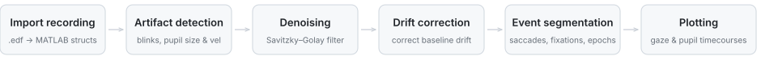
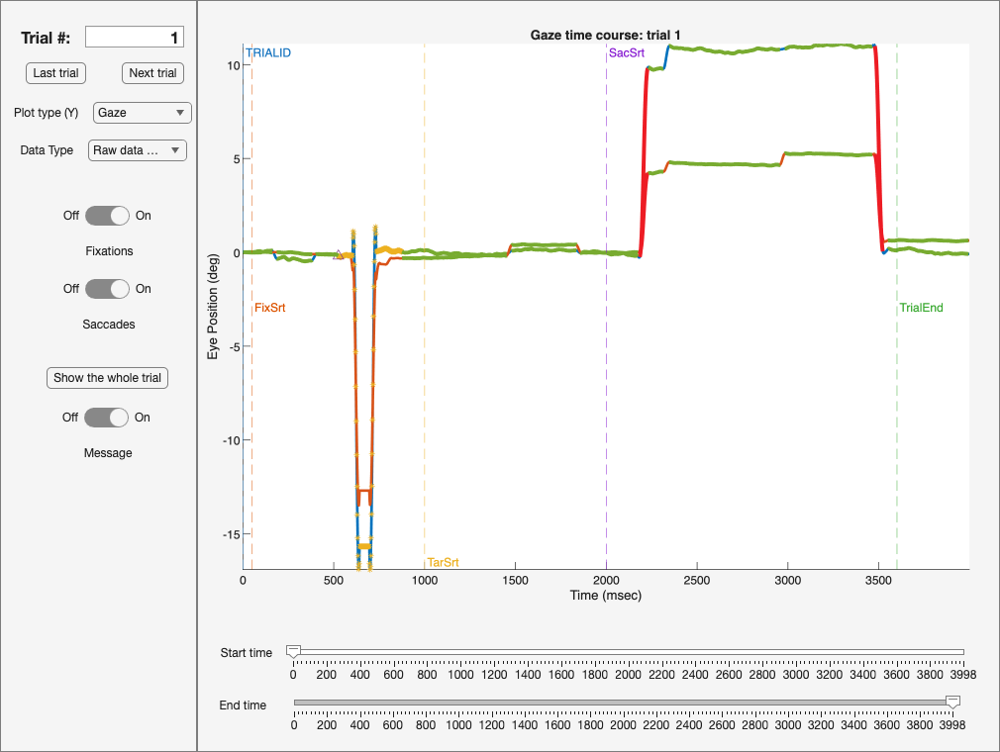

# LJ_Eyes


An automated preprocessing toolbox for EyeLink eye-tracking recordings. Takes raw `.edf`
files and produces cleaned gaze and pupil signals with labelled saccades, fixations, and
blinks — replacing a manual, per-recording workflow that took roughly 10–20× longer.

<p align="center">
  
</p>

### Key methods

- **Velocity & acceleration:** five-sample differentiator (Engbert & Kliegl, 2003)
- **Artifact detection:** median absolute deviation (MAD) for pupil size and velocity outliers
- **Blink detection:** four selectable methods: EyeLink parser, padded window, velocity-based (Mathôt, 2013), noise-based (Hershman et al., 2018)
- **Smoothing:** Savitzky–Golay filter, linear or spline interpolation across gaps
- **Saccade detection:** joint velocity, acceleration, amplitude, and duration thresholds; endpoint computation; merge of noise-split saccades
- **Synthetic test data:** main-sequence saccades with hypometria, corrective saccades and glissades, plus fixational drift, tremor, microsaccades, and lid-artifact blinks, with ground-truth labels for smoke testing

## Quickstart

```matlab
addpath(genpath(pwd))   % from the repo root
run_demo                % generate a synthetic recording, preprocess it, check the output
```

<details>
<summary>Expected output</summary>

```
Synthetic recording: 8 trials, 16000 samples at 500 Hz
Injected: 16 saccades, 8 blinks

Blinks detected:      8  (injected 8)
Samples flagged:      8.64%

Saccades detected:    16 total, 16 large  (injected 16 large)
Fixations detected:   80
Median amplitude:     11.5 deg  (target at 12.0)
Median peak velocity: 440 deg/s

All checks passed.
```
</details>

No participant data ships with this repository, by design. `make_synthetic_recording.m`
generates its input, so the demo doubles as a smoke test — a regression in the detectors
shows up as a failed check rather than a plot that looks plausible.

To process a real recording, replace section 1 of `run_demo.m` with the
`edf2mat` / `get_params` / `load_sample` calls documented at the top of that file.
Processing your own data requires [Edf2Mat](https://github.com/uzh/edf-converter) for
`.edf` import; the demo does not.

## Inspecting a recording

`myGUI_miniEye/miniEye_ver0.mlapp` is a trial-by-trial viewer for preprocessed recordings.
`run_demo` opens it on the synthetic data; to open it on your own, put `edf` and `set` in
the base workspace and run `miniEye_ver0`.



*Trial 1 of the synthetic recording: gaze x (blue) and y (orange), blink samples flagged,
detected saccades in red, fixations in green, trial messages as dashed markers.*

**Signal — Plot type (Y)**

- **Gaze** — horizontal and vertical eye position, in degrees of visual angle
- **Pupil** — pupil size, in EyeLink units

**Processing stage — Data Type**

- **Raw data** — the signal as recorded
- **Raw data with blinks** — raw signal, detected blink intervals and their onsets/offsets marked
- **Raw data with artifacts** — raw signal, every flagged artifact type overlaid
- **Cleaned data** — after artifact removal
- **Drift corrected data** — gaze after drift correction (pupil is unaffected, so it shows the cleaned trace)
- **Baseline corrected data** — pupil after baseline correction

**Event overlays**

- **Saccades** — detected saccade intervals in red
- **Fixations** — detected fixation intervals in green
- **Message** — trial events as dashed vertical markers, labelled from `set.msg`

**Navigation**

- **Trial #** field, or **Last trial** / **Next trial**
- **Start time** / **End time** sliders crop the window within a trial
- **Show the whole trial** resets the window

It is a viewer only: it does not run or modify the pipeline, and detected events cannot be
edited from it. Selecting a stage the loaded recording has not been through says so on the
axes instead of erroring — `run_demo` covers the gaze pipeline, so **Baseline corrected
data** is one of these.

## Processing pipeline

| Stage | What it does | Details |
|-------|-------------|---------|
| **Import recording** | Raw `.edf` → MATLAB structs | Sampling rate, recorded eye, screen geometry, calibration results. Converts px ↔ degrees of visual angle. |
| **Artifact detection** | Flags bad samples | Missing pupil, gaze off screen, extreme gaze velocity/acceleration, extreme pupil size or velocity (MAD units). Merges artifacts closer than a configurable gap. Reports blink count and track-loss percentage. |
| **Denoising** | Removes flagged samples | Linear or spline interpolation, Savitzky–Golay smoothing, pupil baseline correction (subtractive or divisive, mean or median of baseline epoch). |
| **Drift correction** | Corrects for baseline drift | Estimates and removes slow gaze drift. Saccade and fixation detection re-run on the corrected signal. |
| **Event segmentation** | Segments trials and detects events | Epochs from EyeLink messages. Saccades via joint velocity, acceleration, amplitude, and duration thresholds. Fixations. Endpoint computation, noise-split saccade merging. |
| **Plotting** | Gaze and pupil timecourses | Raw and cleaned time courses, artifact distributions, gaze-on-screen plots. |

Every analysis parameter lives in the settings struct. No thresholds are set inside the
processing functions.

## Layout

```
data_import/        .edf import, recording and screen parameters, calibration
data_cleaning/      artifact detection, removal, interpolation, smoothing, drift correction
blink_analysis/     the four blink detection methods
event_detection/    trial/epoch segmentation, saccade and fixation detection
event_selection/    per-trial selection of saccades of interest
plot/               figure generation
myGUI_miniEye/      the inspection GUI
general_functions/  unit conversion and shared helpers
external_functions/ vendored third-party code (own licenses)
demo/               synthetic recording generator and the demo script
```

## Scope

Research code, written for my own and my labmates' use.

- Trial and epoch segmentation is driven by the message strings in the settings struct,
  which are experiment-specific. Applying the toolbox to a new paradigm means editing that
  list, and possibly the event-selection step.
- Only monocular analysis is exercised. The binocular option is present but untested.
- `run_demo` is the only automated check; there is no unit test suite.
- No participant data is distributed with this repository and none will be. If you need to
  validate against a real recording, use your own.

## License

[BSD 3-Clause](LICENSE). Vendored code under `external_functions/` and parts of
`general_functions/` carries its own licenses.

## Credits

[Edf2Mat](https://github.com/uzh/edf-converter) (UZH) for `.edf` reading. Blink detection
after Mathôt (2013) and Hershman, Henik & Cohen (2018). Velocity/acceleration after Engbert
& Kliegl (2003).
